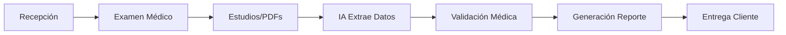
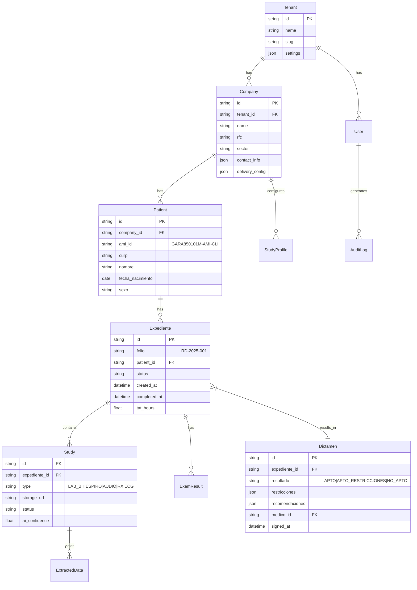
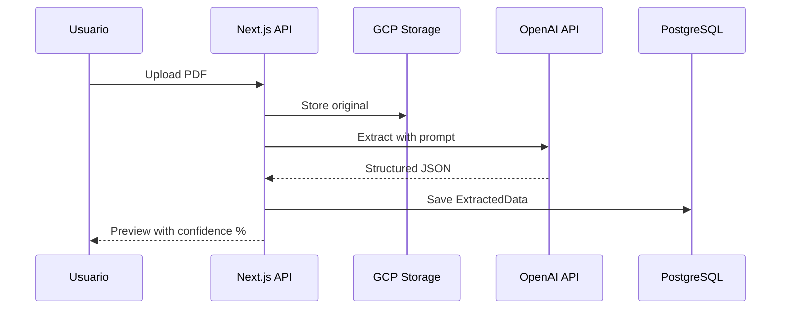

# 🏥 ARQUITECTURA AMI-SYSTEM (Residente Digital)

> **Sistema Modular de Gestión de Salud Ocupacional con IA**  
> Versión: 2.0 | Enero 2026  
> **Estado: ARQUITECTURA DEFINIDA ✓**

---

## ⚠️ DOCUMENTO SUPERSEDIDO

Este documento ha sido reemplazado por la documentación modular:

### ADRs (Decisiones Arquitectónicas)
- **[ADR-ARCH-20260112-01](decisions/ADR-ARCH-20260112-01.md)** - Arquitectura Modular (Monorepo)
- **[ADR-ARCH-20260112-02](decisions/ADR-ARCH-20260112-02.md)** - Stack Tecnológico Completo
- **[ADR-ARCH-20260112-03](decisions/ADR-ARCH-20260112-03.md)** - Modelo de Datos (Prisma Schema)

### SPECs
- **[SPEC-MODULOS-AMI](SPEC-MODULOS-AMI.md)** - Catálogo de 17 módulos
- **[SPEC-FLUJOS-USUARIO](SPEC-FLUJOS-USUARIO.md)** - Flujos completos

### Guías
- **[GUIA-CREAR-MODULO](GUIA-CREAR-MODULO.md)** - Extensibilidad

### Backlog
- **[PROYECTO.md](../PROYECTO.md)** - Épicas, tareas, progress dashboard

---

## Resumen Ejecutivo (Referencia Rápida)

### Stack Principal
| Capa | Tecnología |
|------|------------|
| Frontend | Next.js 14 + React 18 + TypeScript |
| UI | Tailwind CSS + shadcn/ui (PWA mobile-first) |
| Backend | Next.js API Routes + Prisma |
| Database | PostgreSQL (Railway) |
| Auth | Firebase Auth + Custom Claims |
| Storage | GCP Cloud Storage |
| IA | OpenAI API |

### Estructura Modular
```
packages/
├── core/          ← Auth, DB, Storage, UI, Signatures
├── mod-clinicas/  ← Sedes, horarios, capacidad
├── mod-servicios/ ← Catálogo, baterías
├── mod-empresas/  ← Clientes, contratos
├── mod-citas/     ← Agenda, disponibilidad
├── mod-expedientes/ ← Flujo médico
├── mod-validacion/  ← IA + dictamen
├── mod-reportes/    ← PDFs + entrega
├── mod-dashboard/   ← KPIs
├── mod-bitacora/    ← Audit log
├── mod-calidad/     ← Precisión IA
├── mod-admin/       ← Configuración
└── mod-portal-empresa/ ← Portal RH
```

### Principios Clave
1. **Modular**: Cada módulo funciona independiente con Core
2. **Multi-tenant**: `tenantId` en todas las tablas
3. **PWA**: Mobile-first, offline-capable
4. **Trazable**: Audit log completo

---

*Para documentación detallada, consultar los ADRs y SPECs vinculados arriba.*

---

## CONTENIDO LEGACY (Referencia Histórica)

> El contenido a continuación es de la versión anterior y se mantiene como referencia.

---

## 1. Visión del Sistema (Legacy)

**AMI-SYSTEM** (anteriormente RD-AMI) es una plataforma para digitalizar y automatizar el proceso de exámenes médicos ocupacionales, desde la recepción del paciente hasta la entrega del dictamen de aptitud.

### 1.1 Objetivos Principales

1. **Reducir TAT** (Time-to-Aptitude) de 24h a <6h promedio
2. **Automatizar extracción** de datos desde PDFs de estudios médicos
3. **Asistir al médico** con semáforos clínicos y sugerencias de dictamen
4. **Trazabilidad completa** de todo el proceso (audit log)
5. **Entrega digital segura** con enlaces caducables

### 1.2 Flujo de Alto Nivel



---

## 2. Stack Tecnológico

### 2.1 Frontend
| Componente | Tecnología | Justificación |
|------------|------------|---------------|
| Framework | **Next.js 14** (App Router) | SSR, API routes, performance |
| UI Library | **shadcn/ui** | Componentes accesibles, customizables |
| Styling | **Tailwind CSS** | Utility-first, consistente con demo |
| State | **Zustand** o React Context | Simple, sin boilerplate |
| Forms | **React Hook Form + Zod** | Validación tipada |
| PDF Viewer | **react-pdf** | Visualización en Validación |
| PDF Generation | **@react-pdf/renderer** | Papeletas y reportes |

### 2.2 Backend
| Componente | Tecnología | Justificación |
|------------|------------|---------------|
| API | **Next.js API Routes** | Monorepo, mismo deployment |
| ORM | **Prisma** | Type-safe, migrations |
| Database | **PostgreSQL (Railway)** | Relacional, multi-tenant ready |
| Auth | **Firebase Auth** | Custom claims para roles |
| Storage | **GCP Cloud Storage** | PDFs originales inmutables |
| Queue (futuro) | **BullMQ + Redis** | Workers IA async |

### 2.3 IA / ML
| Componente | Tecnología | Justificación |
|------------|------------|---------------|
| Extracción PDFs | **OpenAI API** (ChatGPT Salud) | Prompts estructurados |
| OCR Fallback | **Google Vision API** | PDFs escaneados |
| Clasificación | Reglas + IA | Tipo de estudio automático |

### 2.4 Infraestructura
| Componente | Servicio | Detalles |
|------------|----------|----------|
| Frontend Hosting | **Vercel** | Edge functions, CI/CD |
| Database | **Railway** | PostgreSQL managed |
| Storage | **GCP Cloud Storage** | Bucket `ami-system-pdfs` |
| Secrets | **Vercel + Railway env vars** | No código hardcoded |
| Progress Dashboard | **cPanel vcorp.mx** | https://vcorp.mx/progress-ami/progressdashboard/ |

---

## 3. Modelo de Datos (Entidades Principales)



### 3.1 Multi-tenancy

Todas las tablas principales incluyen `tenant_id` para aislamiento de datos:

```typescript
// Middleware Prisma para auto-filtrar por tenant
prisma.$use(async (params, next) => {
  if (params.action === 'findMany' || params.action === 'findFirst') {
    params.args.where = {
      ...params.args.where,
      tenant_id: getCurrentTenantId()
    };
  }
  return next(params);
});
```

---

## 4. Módulos del Sistema

### 4.1 Módulos Core (FASE 1)

| Módulo | Ruta | Descripción |
|--------|------|-------------|
| **Recepción** | `/recepcion` | Alta paciente, selección estudios, genera papeleta |
| **Examen Médico** | `/examen/[id]` | Captura signos vitales, exploración, antecedentes |
| **Estudios** | `/estudios/[id]` | Upload PDFs, clasificación IA, extracción datos |
| **Validación** | `/validacion/[id]` | Vista dual, semáforos, dictamen, firma |
| **Reportes** | `/reportes/[id]` | Genera papeleta PDF, reporte completo |

### 4.2 Módulos Operativos (FASE 2)

| Módulo | Ruta | Descripción |
|--------|------|-------------|
| **Dashboard** | `/dashboard` | KPIs, expedientes pendientes, productividad |
| **Papeletas** | `/papeletas` | Listado general con filtros |
| **Empresas** | `/empresas` | Catálogo clientes, perfiles, config |
| **Expedientes** | `/expedientes/[id]` | Generador envío, historial |
| **Bitácora** | `/bitacora` | Audit log con filtros |

### 4.3 Módulos Admin (FASE 2-3)

| Módulo | Ruta | Descripción |
|--------|------|-------------|
| **Analytics** | `/analytics` | Reportes ejecutivos, cuellos botella |
| **Calidad** | `/calidad` | Precisión IA, alertas, auditorías |
| **Comunicaciones** | `/comunicaciones` | Notificaciones, mensajería |
| **Admin** | `/admin` | Usuarios, roles, semáforos config |

---

## 5. Sistema de Semáforos Clínicos

### 5.1 Niveles

| Nivel | Emoji | Color | Significado |
|-------|-------|-------|-------------|
| CRÍTICO | 🔴 | `red-500` | Valor fuera de rango seguro, requiere atención |
| SEGUIMIENTO | 🟡 | `yellow-500` | Valor borderline, documentar recomendación |
| NORMAL | 🟢 | `green-500` | Dentro de rangos aceptables |

### 5.2 Configuración por Estudio

```yaml
# Ejemplo: semaforos_config.yaml (a traducir a TypeScript)
laboratorio:
  hemoglobina:
    unidad: "g/dL"
    rojo: { max: 10 }
    amarillo: { min: 10, max: 12 }
    verde: { min: 12 }
    
espirometria:
  fvc_porcentaje:
    unidad: "%"
    rojo: { max: 60 }
    amarillo: { min: 60, max: 80 }
    verde: { min: 80 }
```

### 5.3 Implementación TypeScript

```typescript
// src/lib/clinical-rules/semaphores.ts
type SemaphoreLevel = 'CRITICAL' | 'WARNING' | 'NORMAL';

interface SemaphoreConfig {
  field: string;
  unit: string;
  thresholds: {
    critical: { min?: number; max?: number };
    warning: { min?: number; max?: number };
    normal: { min?: number; max?: number };
  };
}

function evaluateSemaphore(value: number, config: SemaphoreConfig): SemaphoreLevel {
  const { critical, warning } = config.thresholds;
  
  if ((critical.max && value < critical.max) || 
      (critical.min && value > critical.min)) {
    return 'CRITICAL';
  }
  
  if ((warning.min && value >= warning.min && warning.max && value <= warning.max)) {
    return 'WARNING';
  }
  
  return 'NORMAL';
}
```

---

## 6. Integración con IA

### 6.1 Pipeline de Extracción



### 6.2 Prompts Estructurados

```typescript
const EXTRACTION_PROMPT = `
Analiza el siguiente documento médico y extrae los datos estructurados.

Tipo de estudio: {studyType}
Contexto: Examen médico ocupacional para aptitud laboral

Responde SOLO con JSON válido siguiendo este schema:
{
  "tipo_estudio": string,
  "fecha_estudio": "YYYY-MM-DD",
  "resultados": {
    // campos específicos según tipo
  },
  "confianza": number, // 0-100
  "observaciones": string | null
}
`;
```

### 6.3 Fases de IA (Prioridad)

1. **FASE 1**: Extracción básica (Laboratorio BH, QS)
2. **FASE 2**: Estudios especiales (Espirometría, Audiometría)
3. **FASE 3**: Imágenes complejas (Radiografías, ECG)

---

## 7. Seguridad y Compliance

### 7.1 Autenticación

- Firebase Auth con email/password
- Custom claims para roles:
  ```json
  {
    "role": "medico_validador",
    "tenant_id": "ami-queretaro",
    "permissions": ["validate", "sign", "view_reports"]
  }
  ```

### 7.2 Roles del Sistema

| Rol | Permisos |
|-----|----------|
| `recepcionista` | Alta pacientes, ver papeletas propias |
| `tecnico` | Upload estudios, ver expedientes asignados |
| `medico_examinador` | Capturar examen médico |
| `medico_validador` | Validar, firmar, generar dictamen |
| `coordinador` | Ver todo, reasignar, reportes |
| `admin` | Config sistema, usuarios, semáforos |

### 7.3 Audit Log

Todo cambio genera entrada en `AuditLog`:

```typescript
interface AuditLogEntry {
  id: string;
  timestamp: Date;
  user_id: string;
  action: 'CREATE' | 'UPDATE' | 'DELETE' | 'VIEW' | 'SIGN' | 'SEND';
  entity_type: string;
  entity_id: string;
  changes: Record<string, { old: any; new: any }>;
  ip_address: string;
  user_agent: string;
}
```

---

## 8. API Endpoints (Preview)

### 8.1 Pacientes
- `POST /api/patients` - Alta paciente
- `GET /api/patients?company=X` - Listar por empresa
- `GET /api/patients/[id]` - Detalle paciente

### 8.2 Expedientes
- `POST /api/expedientes` - Crear expediente/papeleta
- `GET /api/expedientes/[id]` - Detalle con estudios
- `PATCH /api/expedientes/[id]/status` - Cambiar estado

### 8.3 Estudios
- `POST /api/studies/upload` - Upload PDF
- `POST /api/studies/[id]/extract` - Trigger extracción IA
- `GET /api/studies/[id]/preview` - Preview datos extraídos

### 8.4 Validación
- `POST /api/dictamen` - Crear dictamen
- `POST /api/dictamen/[id]/sign` - Firmar digitalmente

### 8.5 Reportes
- `GET /api/reports/papeleta/[id]` - Generar papeleta PDF
- `GET /api/reports/expediente/[id]` - Expediente completo
- `POST /api/reports/[id]/send` - Enviar por email

---

## 9. Deployment y CI/CD

### 9.1 Ambientes

| Ambiente | URL | Branch | Database |
|----------|-----|--------|----------|
| Development | localhost:3000 | `develop` | Local Docker |
| Staging | ami-staging.vercel.app | `staging` | Railway (staging) |
| Production | ami-system.vercel.app | `main` | Railway (prod) |

### 9.2 GitHub Actions

- **On PR**: Lint, Type check, Tests
- **On merge to main**: Auto-deploy Vercel
- **On PROYECTO.md change**: Deploy progress dashboard

### 9.3 Variables de Entorno

```bash
# Database
DATABASE_URL="postgresql://..."

# Auth
FIREBASE_PROJECT_ID="ami-system"
FIREBASE_CLIENT_EMAIL="..."
FIREBASE_PRIVATE_KEY="..."

# Storage
GCP_PROJECT_ID="ami-system-storage"
GCP_BUCKET_NAME="ami-system-pdfs"
GCP_SERVICE_ACCOUNT_KEY="..."

# AI
OPENAI_API_KEY="sk-..."
OPENAI_MODEL="gpt-4-turbo"

# App
NEXT_PUBLIC_APP_URL="https://ami-system.vercel.app"
```

---

## 10. Referencia Documentos

| Documento | Ubicación | Propósito |
|-----------|-----------|-----------|
| Checklist Legacy | [context/00_CHECKLIST_LEGACY_CONSOLIDADO.md](context/00_CHECKLIST_LEGACY_CONSOLIDADO.md) | Todo lo importado del legacy |
| Demo Funcional | `context/LEGACY_IMPORT/ami-rd/.../Demos funcionales/RD/` | Referencia UI (4,146 líneas) |
| Semáforos Config | `context/LEGACY_IMPORT/ami-rd/.../05_RULES/semaforos_config.yaml` | Umbrales clínicos |
| Mapeo Campos | `context/LEGACY_IMPORT/ami-rd/context/AMI a Residente Digital/` | 1000+ campos SIM/NOVA |
| Metodología | `meta/` | Sistema INTEGRA v2.0 |

---

**Documento mantenido por**: INTEGRA-Arquitecto  
**Última actualización**: Enero 2025  
**Estado**: Draft v1 - Pendiente revisión GEMINI
